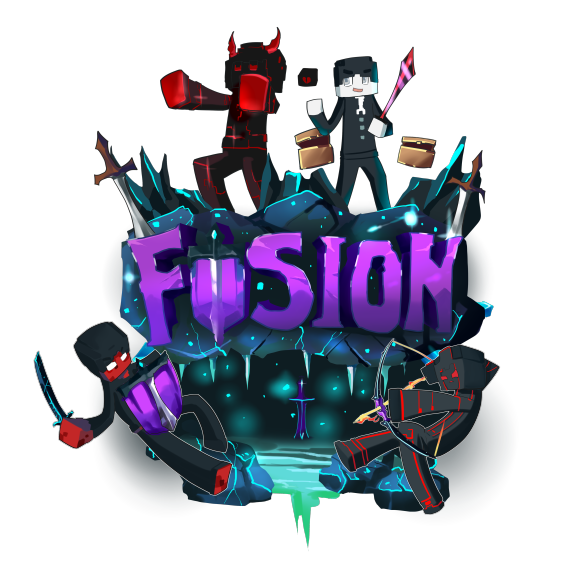

# Fusion Network Website

  
  <h3>A Modern Minecraft Server Platform</h3>

## 📌 Overview
Fusion Network's website is a full-featured platform built to manage our Minecraft server community. It includes user authentication, staff applications, profile management, and server status monitoring.

## 🚀 Features
- **User Management**
  - Account registration and authentication
  - Profile customization
  - Minecraft account linking
  - Role-based access control

- **Staff System**
  - Application submission and management
  - Admin review interface
  - Application status tracking
  - Staff team showcase

- **Server Integration**
  - Real-time player count
  - Server status monitoring
  - Discord member count
  - One-click IP copy

## 💻 Tech Stack
- **Backend**: Node.js, Express
- **Database**: SQLite3
- **Frontend**: EJS, CSS3, JavaScript
- **Authentication**: Express Sessions
- **Security**: bcrypt, helmet

## �� Project Structure